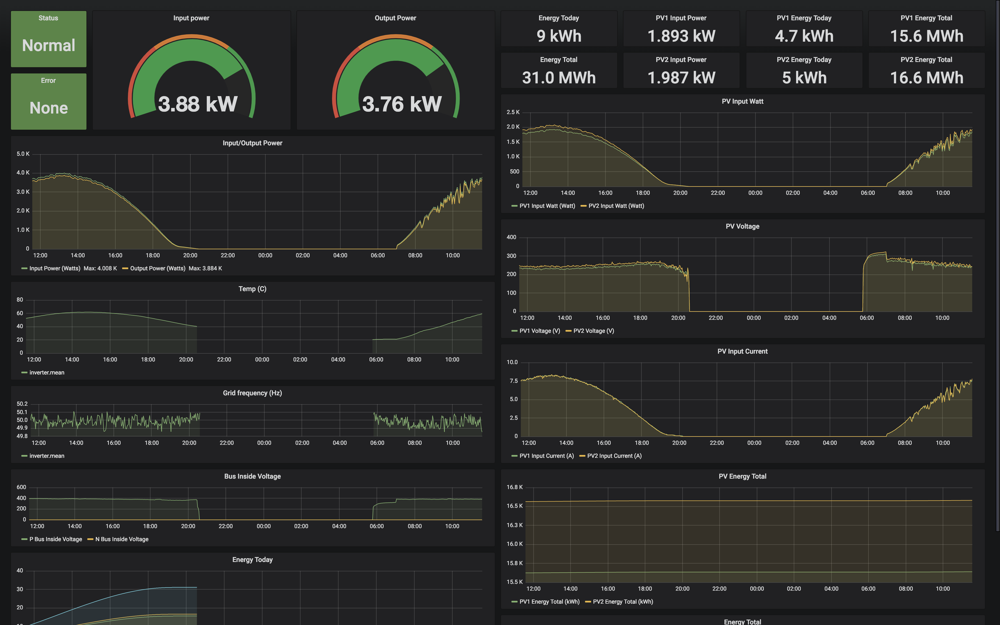

Solarmon
----
A simple Python Script for reading Growatt PV Inverter Modbus RS485 RTU Protocol and storing into InfluxDB

[Protocol Documentation](docs/README.md)

How to use
----
- Some hardware running a Linux based OS with Python 3 (eg. Raspberry Pi)
- Connect your Linux based OS to the RS485 port on the inverter via a RS485 to USB cable
- [Install InfluxDB](https://www.influxdata.com/)
- Copy `solarmon.cfg.example` to `solarmon.cfg` and modify the config values to your setup as needed
- Run `pip install -r requirements.txt`
- Run `python solarmon.py` in a screen (or you could setup a service if that is your preference)
- [Install Grafana](https://grafana.com/)
- Go to http://localhost:3000/dashboard/import or equivalent for where you installed Grafana and import `grafana/dashboard.json`




Reading from Multiple Units
----
To read from multiple units add a new section to the `solarmon.cfg` config with the unit's id and the measurement name to store the units data in influxdb
```ini
[inverters.<name>]
unit = <id>
measurement = <mesurement>
```
Example:
```ini
[inverters.unit2]
unit = 2
measurement = inverter2
```

To view the data using a Grafana dashboard simply import the template like described above in "How to use" and then change the measurement variable at the top of the page to match what you put in the config, in the example that is 'inverter2'. 
